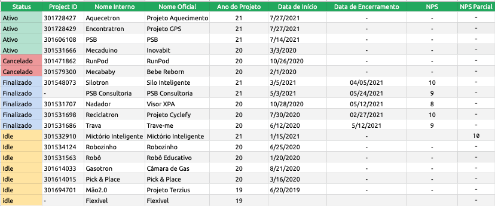
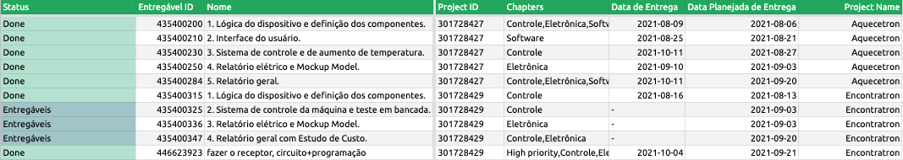
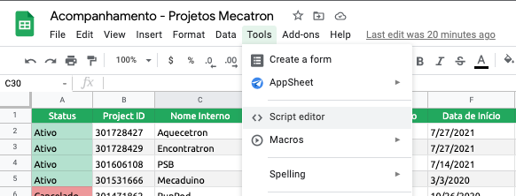
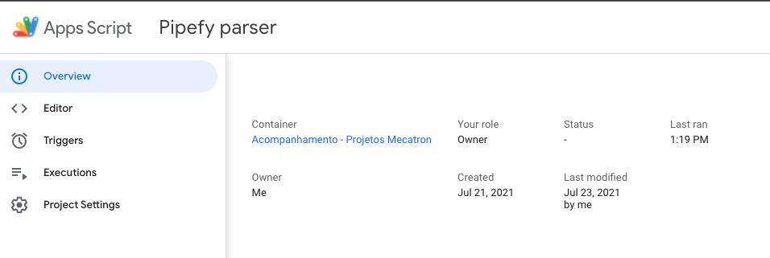
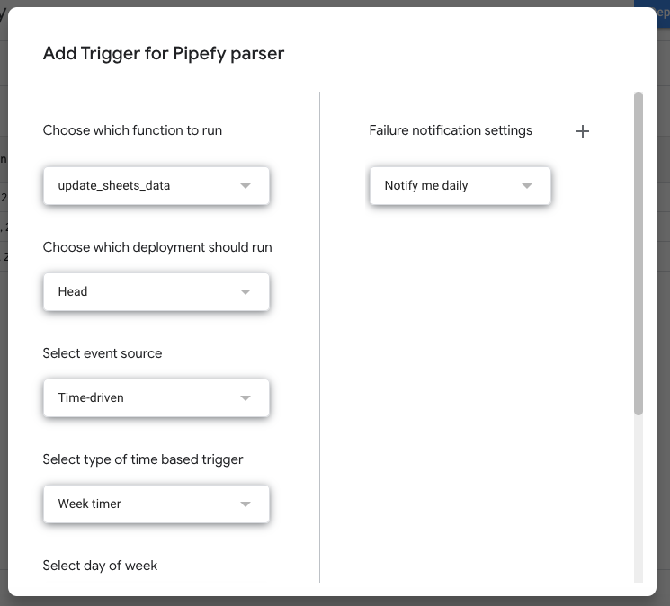
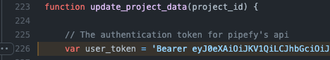
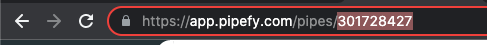

# Pipefy Project Management Automation

## Overview 
- This application is used to automatically keep track of the most important progress indicators for projects that use the pipefy platform.
As described in more detail down the line, this project runs as a Google Script in the background of Google Sheet's spreadsheet that is used to keep track of all the projects in our enterprise.

- It basically gets, trough pipefy's GraphQl API, the cards and their data for each project pipe [set as active in the Spreadsheet's Main Page](####-main-page). From their, they are able to differentiate rather a
card is a deliverable or a sub-deliverable through their tags (deliverables have the `Entregável` label) and save the important information in the corresponding sheet.

- Although this automation may be really specific to our needs, the code was writtern as modulas as possible, so you can interface with Pipefy's API the way it suits your needs.

## Google Sheets
- Our spreadsheet is divided into 7 different pages, where 4 of them are related to google forms (those of which we are not going to cover here) and 3 that are directly related to the pipefy
automation, those being:
  
1. The main Page
2. The deliverables Page
3. The sub-Deliverables Page

### Pages
#### Main Page

- As seen in the image above, the main page has the following Columns:

Column Name|Description 
-----------|-----------
`Status`   | Describes the current status of the project, can be `Ativo`, `Cancelado`, `Finalizado` or `Idle`
`Project ID` | Is the Unique ID for the project's pipe on pipefy
`Nome Interno` | Is the name used internally to reference the project
`Nome Oficial` | Is the name of the project used by the client and used in the contract
`Ano do Projeto` | The year the project was initiated
`Data de Início` | The exact date that the project begun, in the `mm/dd/yyyy` format.
`Data de Encerramento` | The date the project ended in the `mm/dd/yyyy` format, if not finished has the value `-`.
`NPS` | The net promoter score collected after the end of the project (we use a Google Form so it is directly linked to it)
`NPS Parcial` | The last promoter score collected during the project development

- A couple things are worth pointing out:
    - The `Project ID` Is used by the automation system to get the information, so it is really important to get the right one, as show in the [Pipefy portion of the README](###-how-to-get-pipe-id).
    - The `Status` is used to determine which pipe's data are to be updated (i.e they will __*only*__ update the data in the Spreadsheet from `Active` projects). So if a project is no longer active you
    should change the status from `Active` so it doesn't wast time.
    - If you want to add a new project just add the necessary information  to the next new line and the next time it runs it will do thing.

#### Deliverables Page

- As seen in the image above, the main deliverables page has the following structure:

Column Name | Description 
------------|------------
`Status`    | Describes the current status of the deliverable, it can be `Done`, `Sprint`, `Entregáveis` or `Fazendo essa semana`.
`Entregável ID` | The deliverable's Unique Id, that is actually the pipfy's card unique ID.
`Project ID` | The Unique ID from the project the deliverable belongs to.
`Chapter` | What [chapters](https://www.atlassian.com/agile/agile-at-scale/spotify) the deliverable belongs to (if more than one they are comma separated), for our use case they can be `CAD`, `Eletrônica` or `Controle`.
`Data de Entrega` | The date the deliverable was validated by the customer in the `yyyy-dd-mm` format, if not yet finished has the value `-`.
`Data Planejada de Entrega` | The date the deliverable was originally dated to be delivered in the `yyyy-dd-mm` format, if none provided has the value `-`.
`Project Name` | The Internal project name, to be easier for people analyzing the dataset on google sheets.

#### Sub-deliverables Page

- The sub-deliverables sheet has the following structure:

Column Name | Description
------------|------------
`Status` | Describes the current status the sub-deliverable is at, it can be `Done`, `Preciso Fazer`, `Fazendo Hoje`, `Fazendo Essa Semana`.
`Subentregável ID` | The UNique Id for the sub-deliverable, that is actually pipfy's card unique ID.
`Nome` | The name of the sub-deliverable.
`Chapter` | What [chapters](https://www.atlassian.com/agile/agile-at-scale/spotify) the deliverable belongs to (if more than one they are comma separated), for our use case they can be `CAD`, `Eletrônica` or `Controle`.
`Mecapoints` | The planning poker points that the team determined.
`Dia de Início` | The date (`yyyy-mm-dd`) that for the first time the sub-deliverable started to be worked on (it is considered the firs time the team moved to the "Doing Today" column), if it hasn't started it has the `-` value.
`Dia de Finalização` | The date (`yyyy-mm-dd`) the sub-deliverable was finished (i.e the date it was moved to the "Done" column).
`Dia Planejado de Finalização ` | The date (`yyyy-mm-dd`) that the sub-deliverable was planned to be finished, if none was added by the team it has the `-` value.
`Entregável ID` | The parent deliverable that the sub-deliverable is related to, if not related to any has the `-` value.
`Project ID` | The parent project ID, not null.
`Responsáveis` | A list of the assignees for the particular sub-deliverable (concatenated and separated by comma).

### SetUp
- To setup we first go to the spreadsheet, click in the tools button (in the top bar) and click in `script editor`:

- After that you will be in the automation space, where you can find the dashboard called `Overview` containing a summary of your code status, the script editor called `Editor` where you can put the
code in to run (or modified if already there), the `Triggers` panel (where you can set the automation to run at certain times of the day/week etc), the `Executions` panel (where you can see the
automation status of the las 7 days) and the `Project Settings`:

#### Triggers
- As stated above, we are able to set triggers (i.e rules to when run the automation) in the `Triggers` menu.
- Most of the times we want to use the `time-driven` event source and as the type of time based trigger we want the `week-times`, so we can set a day of the week and a time of that day to run the
  automation (keeping in mind that we are able to set multiple triggers). Also, the triggers needs a specific function to run when the time comes, because of that we made the `update_sheets_data()`
  our main function and encapsulate the whole program in it:
  
  

#### Credentials 
- To access the information from pipefy, we need an API Key. We explain [how to do it here](###-setup-and-api), but after that you need to [update it in the
  code](https://github.com/Mecatron-Projetos-e-Consultoria-Jr/Pipefy_API/blob/9ee4350cdb954a6044a2158860b4b71822612162/src/pipefy.gs#L226), to match you API Key: 
  

    - $OBS$: The above credential does not work anymore !!!
    - $OBS^2$: You need to keep the `Bearer ` part on the code !

## Pipefy

### SetUp and API
- To get a new API key you can go to [this website](https://app.pipefy.com/tokens) to get a new access token to pipefy's API.
- One important thing to keep in mind is that the account in which you made the login and generated the API Key will need to be part of all the projects pipes to be able to get the data from them.

### How to get Pipe ID
- Once you created you pipe, most preferably by coping another pipe (e.g Aquecetron's pipe) as a template to ensure that all the structure is compatible with the automation, you simply go to the
  browser bar and copy the numeric value: 
  
- And there we have our Pipe ID.